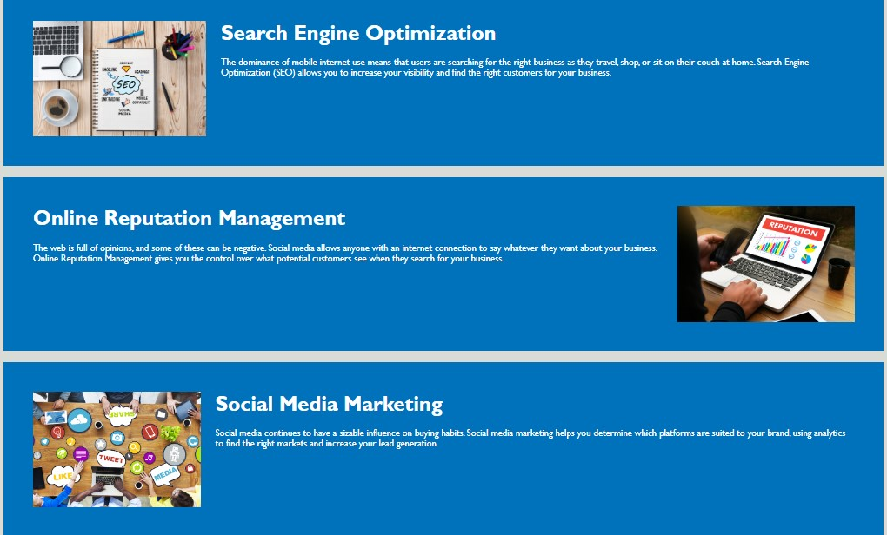

# Challenge Week 1

## Horiseon SEO Website

The objective of this project was to refactor a starter code for this website in order to improve accessibility and overall readability of the code.

This was achieved by the following steps:

* Description and keywords meta tags were added.
* In the HTML file, non-semantic div tag were replaced by semantic tags such as header, figure, main, aside, section and footer.
* Alt attributes were added to all images and icons.
* CSS file was modified to remove redundant selectors and classes.
* Comments were added throughout the code, in both HTML and CSS files.

[The live site can be found here.](https://totes7.github.io/challenge-week-one/)

Below is a mock-up of the final product.

## User Experience (UX)

### User Story

* AS A marketing agency, I WANT a codebase that follows accessibility standards, SO THAT our own site is optimized for search engines.

## Usage

* The website is easy to navigate thanks to the navbar at the top of the page.

* The links are connected to the main section, which you can see below.

* On the right side of the page you can find the benefits section.

* At the bottom of the page you can find the footer.

## Deployment

* The site was deployed to GitHub Pages. The steps required are as follows:
    * From the GitHub main repository, navigate to Settings page.
    * Locate the Pages section.
    * Here, select Main Branch from the drop-down menu.
    * Once selected, GitHub will generate a link to the complete website.

## Technologies Used

### Languages Used

* [HTML5](https://en.wikipedia.org/wiki/HTML5)
* [CSS3](https://en.wikipedia.org/wiki/CSS)
* [Markdown](https://en.wikipedia.org/wiki/Markdown)

## Media

All the images and the icons were provided in the started code.

## Credits

The starter code was provided by the Bootcamp Spot instructor team.

## License

N/A